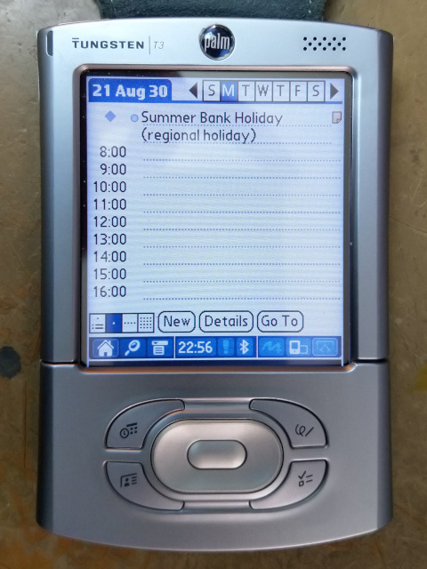

# google-calendar-to-palm-pilot
Make your Palm Pilot useful again by downloading your Google Calendar to it.

`senddatebook.py`, when running, should listen on the specified port and upon triggering a HotSync on the PalmOS device connected to that port, fetch a specified set of Google Calendar/ics files, convert these, and send them to the PalmOS device.

Requires [pilot-link](https://github.com/jichu4n/pilot-link), [pilot-datebook](https://github.com/guruthree/pilot-datebook), and the python [iCalendar](https://github.com/collective/icalendar) library. Also, sorry, Python 2.7. Only tested under Linux.

No warranty or guarantee is offered or implied. Some calendar events may not show up, repeat correctly, or may not have an alarm. Times may be off with respect to daylight savings times. Soooo much of this is untested.

## Setup
1. Install pilot-link and pilot-datebook
2. If you don't already have a Python 2.7 environment with the iCalendar Python library, install [Anaconda](https://www.anaconda.com/products/individual) to get one
    1. After installing Anaconda either run `conda init` or source the profile, e.g. `source ~/anaconda3/etc/profile.d/conda.sh`
    2. Setup a Python 2.7 environment `conda create -n py27 python=2.7`
    3. Install the iCalendar python library `conda install icalendar`
    4. Activate and do everything else inside the Python 2.7 environment `conda activate py27`
3. Setup the pilot-link Python 2.7 bindings (I couldn't get these working in Python 3 or I would have used it)
    1. Change to the pilot-link Python bindings folder, e.g. `cd pilot-link-0.2.12.5/bindings/Python`
    2. Build the bindings `python2 setup.py build`
4. Download this repo, e.g. `git clone https://github.com/guruthree/google-calendar-to-palm-pilot.git`
5. Get some files into `google-calendar-to-palm-pilot`
    1. Copy `_pisock.so`, `pisock.py`, and `pisockextras.py` from the `pilot-link-0.2.12.5/bindings/Python/build/lib.linux-x86_64-2.7`
    2. Add a link to the compiled `pilot-datebook` binary
6. Edit `datebook.cfg` to point to your calendar ics files, which for Google calendar [can be found in calendar settings](https://support.google.com/calendar/answer/37648?hl=en#zippy=%2Cget-your-calendar-view-only)
    1. Multiple calendars can be specified by comma separation
    2. The PalmOS devices local time zone can be specified in the config file
    3. Calendar entries from before the January 1st of the specified year will be ignored
7. Run `senddatebook.py` with the port the PalmOS device is connected to specified via `-p` and the configuration file specified via `-c`, e.g. `./senddatebook.py -p net:any -c datebook.cfg`

## Expected behaviour
Output should be something like this:
```
$ ./senddatebook.py -p net:any -c datebook.cfg
Waiting for connection on net:any...
Fetching https://www.google.com/calendar/ical/en_gb.uk%23holiday%40group.v.calendar.google.com/public/basic.ics...
Parsing...
Done parseing
                                                  
Statistics:
Input file </tmp/tmpdnA6us>, format <csv>:
Input file format <untimed,beginDate,beginTime,endDate,endTime,description,note,alarm,advance,advanceUnit,repeatType,repeatForever,repeatEnd,repeatFrequency,repeatDay,repeatWeekdays,repeatWeekstart>
Input file header <untimed,beginDate,beginTime,endDate,endTime,description,note,alarm,advance,advanceUnit,repeatType,repeatForever,repeatEnd,repeatFrequency,repeatDay,repeatWeekdays,repeatWeekstart>
Lines read: 76
Records read: 75
Csv field <untimed> was read 75 times
Csv field <beginDate> was read 75 times
Csv field <beginTime> was read 75 times
Csv field <endDate> was read 75 times
Csv field <endTime> was read 75 times
Csv field <description> was read 75 times
Csv field <note> was read 75 times
Csv field <alarm> was read 75 times
Csv field <advance> was read 75 times
Csv field <advanceUnit> was read 75 times
Csv field <repeatType> was read 75 times
Csv field <repeatForever> was read 75 times
Csv field <repeatEnd> was read 75 times
Csv field <repeatFrequency> was read 75 times
Csv field <repeatDay> was read 75 times
Csv field <repeatWeekdays> was read 75 times
Csv field <repeatWeekstart> was read 75 times

Output file </tmp/tmpdnA6us.pdb>, format <pdb>:
Records written: 75

Sending DatebookDB...
Done
Waiting for connection on net:any...
```

The script should just loop for ever, but quit gracefully on Ctrl-C. The default configuration will load in UK national holidays.



## Quality of life
Wouldn't it be great if the calendar could be automatically loaded in? It's not impossible. I've found two tools that will automate HotSyncs, [AutoSync](https://archive.org/details/tucows_33516_AutoSync) and [Syncer](https://freeware.palmclub.nl/9f/132-syncer.html).

AutoSync will run a HotSync up to every 15 minutes, either all day or over specified hours, but only while in the cradle. In my testing, the cradle did not have to be connected, to the computer for data.

Syncer will initiate an automatic HotSync once a day. The author reports mixed feedback on if the device needed to be in the cradle. For me at least, with my Tungsten T3 it worked when not in the cradle, initiating a modem HotSync completely wirelessly over ppp over Bluetooth.

### Networking (in brief)

Networking over the Palm is easiest in my experience with ppp. Install pppd and then run `sudo pppd /dev/ttyUSB0 19200 10.0.0.1:10.0.0.2 proxyarp passive silent noauth local persist nodetach` as root. Setup a static IP on the Palm as 10.0.0.2 with a gateway of 10.0.0.1. To give it internet access run `sudo iptables -t nat -I POSTROUTING -s 10.0.0.0/8 -o eth0 -j MASQUERADE` and then add a DNS server of 1.1.1.1 (Cloudflare) or 8.8.8.8 (Google). (Setup a new connection for this in Prefs -> Network, then edit the Details.)

For more exciting Bluetooth wireless (but still serial) networking, get bluez installed (with legacy tools) on your system. Use bluetoothctl to pair the PalmOS device to your PC and set as trusted on both devices. Make The bluez system service will need the `--compat` flag [added to the launch arguments](https://installfights.blogspot.com/2018/01/how-to-enable-bluetooth-connection-in.html). After restarting the service, sdptool can be used to specify that the computer is open for Bluetooth serial connections `sudo sdptool add --channel=22 SP`. At this point [rfcomm can be run to listen for an incoming serial connection](https://unix.stackexchange.com/questions/92255/how-do-i-connect-and-send-data-to-a-bluetooth-serial-port-on-linux) and when it receives one to launch ppp to accept a network connection. `sudo rfcomm listen /dev/rfcomm0 22 pppd /dev/rfcomm0 115200 10.0.0.1:10.0.0.2 proxyarp passive silent noauth local persist nodetach`.
